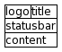
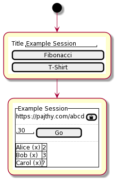
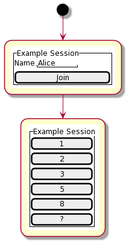

## The Plan

Pajthy is a scrum master companion app. The name is a wordplay consisting of
the hungarian word "pajti" (meaning buddy) and the last name of my favorite
scrum master (Tajthy) to whom this app is dedicated to.

The app is meant to make scrum master's life easy during grooming sessions (or
any other times when a guesstimating required). The main idea is the scrum
master creates a new session (described in the 
[scrum master flow](#scrum-master-flow)), sets up the details of the voting
(things like the scoring system or the timeout); sends the link to the engineers;
engineers opening the link, entering the [engineer flow](#engineer-flow) and
wait until the scrum master starts the vote. The same session is available for
any number of votings with the same scoring
system.

There are countless tools out there that doing almost the same - I know, we
tried out a lot of them. Seemingly none we tried were actually tried out in
real conditions: changing windows or tabs between our ticketing system (and/or
with our video conferencing window) and the voting app is kinda tedious
after a while. This app is designed keeping this in mind: if the engineers
open their flow on their phones then only the scrum master has to suffer the
endless switching between tools during a session. Win for the engineers!

### Scrum Master flow

When the scrum masters are landing the page (going to address it as
`https://pajthy.com` for now) they will get to enter the name of the session
(just a short description, like "Team grooming on tuesday") and pick the
scoring system the team uses. By clicking on one of those, the app moves
onto the "admin" page, where our scrum master can see the link that they
can share with the team (so they can vote); the timeout of a single voting
can be changed (by default it's 30 seconds) and by pressing the GO button
the countdown starts.

On the bottom of this page there is a table where all the joined team members
are present. Next to each team member's name there is a small `x` - by clicking
it the voter will get removed from the session. During a vote when a user voted
it's row get's highlighted (so it's obvious whom we are still waiting for).
After all the votes arrived (or the countdown reached zero) the results will
show up - showing everybodies vote. Clicking on GO again will reset the table
and start the countdown simultaneously.

The backend will take care of cleaning a stale session after 24-48 hours.

### Engineer flow

Engineers landing on the link shared by their scrum master (say 
`https://pajthy.com/abcd`) will see the title of the session, can define
the name they participate with (one can _definitely_ use emojis here) and
join the voting.

The only time the options are clickable when a voting countdown is in progress
and the user did not vote yet. The remaining time will only show in the form of
a progress bar. If I get the permission of the above mentioned scrum master
to use one of his headshots as the logo then a "voting is in progress" animation
would be to flip the logo periodically or rotate it clockwise while voting is
in progress.